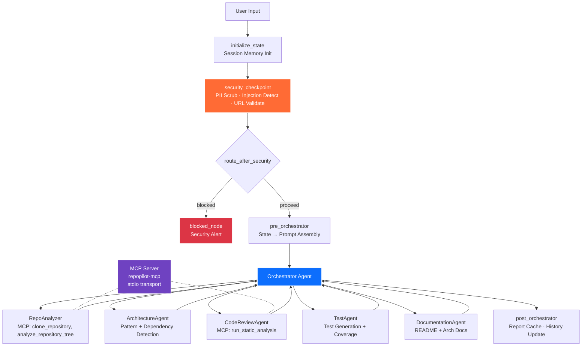

# RepoPilot AI — Submission Write-Up

## Problem Statement

Software developers, engineering teams, open-source contributors, and technical recruiters spend significant time understanding unfamiliar repositories. Tasks such as understanding architecture, reviewing code quality, identifying security issues, generating tests, and producing documentation are manual, repetitive, and time-consuming.

**RepoPilot AI** solves this by providing an autonomous multi-agent system that accepts a repository URL and delivers a comprehensive engineering analysis — architecture patterns, code quality findings, test generation, and documentation — in a single interaction.

---

## Solution Architecture

---

## Concepts Used

### 1. ADK Workflow Graph (`app/agent.py`)
- ADK 2.0 `Workflow` with tuple-based edge definitions
- Function nodes auto-wrapped as `FunctionNode`
- Conditional routing via `route_after_security` → `{"blocked": ..., "proceed": ...}`
- `state_schema=RepoPilotState` for typed shared memory (31 fields)

### 2. LlmAgent Sub-Agents (`app/agent.py`)
- **Orchestrator** — coordinates the 5 specialist agents via `AgentTool` delegation
- **RepoAnalyzer** — clones and maps repository structure (MCP-equipped)
- **ArchitectureAgent** — identifies architecture patterns and dependencies
- **CodeReviewAgent** — performs static analysis (MCP-equipped)
- **TestAgent** — generates missing unit tests and estimates coverage
- **DocumentationAgent** — drafts README and architecture documentation

### 3. AgentTool Delegation (`app/agent.py`)
- Each sub-agent is wrapped as `AgentTool(agent=...)` and provided to the Orchestrator
- The Orchestrator calls sub-agents as tools, enabling multi-agent coordination within a single LlmAgent

### 4. MCP Server (`app/mcp_server.py`)
- Custom MCP server using Python SDK with stdio transport
- 4 domain-specific tools: `clone_repository`, `analyze_repository_tree`, `run_static_analysis`, `execute_test_suite`
- Wired into `RepoAnalyzer` and `CodeReviewAgent` via `MCPToolset`

### 5. Security Checkpoint (`app/agent.py` — `security_checkpoint` function)
- Workflow function node acting as a security gate before analysis
- PII scrubbing (Google API keys, GitHub PATs, passwords, JWT tokens)
- Prompt injection detection (6 keyword patterns)
- Repository URL validation (GitHub/GitLab only)
- Structured JSON audit logging with severity levels (INFO/WARNING/CRITICAL)

### 6. Agents CLI
- Project scaffolded via `agents-cli scaffold create repopilot-ai --deployment-target agent_runtime`
- `GEMINI.md` auto-generated for AI coding guidance
- `make playground` launches the dev UI at localhost:18081

---

## Security Design

| Control | What It Does | Why It Matters |
|---------|-------------|----------------|
| **PII Scrubbing** | Regex masks API keys, GitHub PATs, passwords, JWT tokens | Prevents accidental credential leakage through LLM context |
| **Prompt Injection Detection** | Blocks inputs containing "ignore previous instructions", "execute shell", etc. | Prevents adversarial prompt manipulation of agent behavior |
| **URL Validation** | Only accepts `github.com` and `gitlab.com` URLs | Prevents cloning from malicious or untrusted sources |
| **Audit Logging** | JSON entries with timestamp, severity, action, and scrubbed input | Provides forensic trail for security incidents and compliance |
| **Routing Gate** | `route_after_security` blocks further processing on detection | Hard security boundary — blocked requests never reach the LLM |

---

## MCP Server Design

| Tool | Purpose | Used By |
|------|---------|---------|
| `clone_repository` | Clones a remote Git repository for local analysis | RepoAnalyzer |
| `analyze_repository_tree` | Returns directory structure map | RepoAnalyzer |
| `run_static_analysis` | Detects bugs, code smells, and warnings | CodeReviewAgent |
| `execute_test_suite` | Runs existing tests and reports coverage | CodeReviewAgent |

The MCP server runs as a local stdio subprocess, launched automatically by `MCPToolset` when an agent invokes a tool. No system-level installation required.

---

## HITL Flow (Human-in-the-Loop)

RepoPilot AI includes human-in-the-loop checkpoints:

1. **Security Block** — When prompt injection or invalid URL is detected, the workflow halts and reports to the user. The user must provide a corrected input to proceed.
2. **Playground UI** — The ADK playground at localhost:18081 provides an interactive chat interface where users can inspect agent reasoning, review outputs, and provide follow-up instructions.
3. **Session Persistence** — `ctx.state["session_history"]` preserves the full action timeline, allowing users to resume or inspect previous analyses.

---

## Demo Walkthrough

Refer to the 3 sample test cases in [README.md](README.md):

1. **Normal flow** — `https://github.com/facebook/react` → full multi-agent analysis report
2. **Security block** — injection attempt → CRITICAL alert, request blocked
3. **Invalid URL** — local path → WARNING, user prompted for valid URL

Each test case demonstrates a different path through the workflow graph, exercising security, routing, and agent delegation.

---

## Impact / Value Statement

**Who benefits:**
- **Software Engineers** save hours per repository when onboarding to new codebases
- **Open Source Contributors** get instant architecture maps and code quality insights
- **Engineering Managers** receive automated code review summaries for hiring assessments
- **Students** learn software engineering patterns through AI-generated analysis

**How it matters:**
RepoPilot AI turns a manual, multi-hour process into a single-prompt interaction. By combining ADK multi-agent orchestration with MCP tools and security guardrails, it demonstrates how production-grade AI agents can automate complex engineering workflows while maintaining security and auditability.
